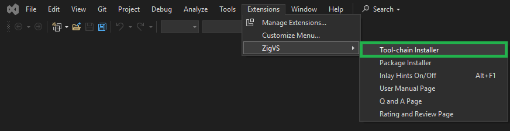
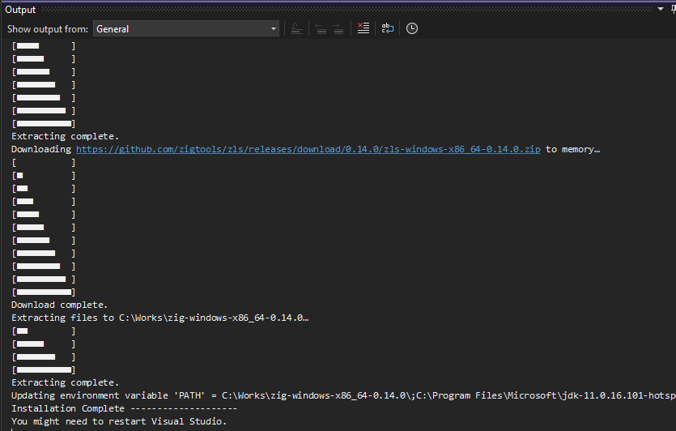

# ZigVS

Add support for using the [Zig programming language](https://ziglang.org/) to [Visual Studio 2022](https://learn.microsoft.com/en-us/visualstudio/windows/?view=vs-2022)  

*Note: Please update Visual Studio before installing ZigVS. If your version of Visual Studio is older than the required version for ZigVS, a version error will appear during installation.* 
___
  
# Features

* Edit Zig code with [Visual Studio Editor](https://learn.microsoft.com/en-us/visualstudio/ide/index-writing-code?view=vs-2022)
    * Zig language syntax highlighting
    * [Zig Language Server (ZLS)](https://github.com/zigtools/zls) support (completions, tool tips, find references and more)
    * Snippets
    * Document Formatting 
    * Auto-Insert Parentheses
* Open Folder mode
  * Build from Visual Studio using build.zig
  * Zig Build System provides [cross-platform build](https://ziglang.org/documentation/0.13.0/#Targets).
  * Application templates
* Project File mode
  * Build from Visual Studio using project files
  * Supports cross-platform build (Windows, Linux, Android, iOS, macOS, WASI / x86, x64, arm, arm64, wasm32)
  * Application, library, file templates
  * build.zig and build.zig.zon generation from project file
* Debug Zig code with [Visual Studio Debugger](https://learn.microsoft.com/en-us/visualstudio/debugger/?view=vs-2022)  
    * Support the Windows Native Debug Engine and [MIEngine](https://github.com/microsoft/MIEngine) for cross-platform debugging (Linux, Android, MacOS, iOS)  [new!!]
* Run code tests using [Visual Studio Testing Tools](https://learn.microsoft.com/en-us/visualstudio/test/?view=vs-2022)
    * Run, debug & manage unit tests from [test explorer](https://learn.microsoft.com/en-us/visualstudio/test/run-unit-tests-with-test-explorer?view=vs-2022)
* Supports [Visual Studio Profiler Tools](https://learn.microsoft.com/en-us/visualstudio/profiling/?view=vs-2022)
  * CPU Usage, Memory Usage, Events, File I/O
* Zig Tool-chain Installer
* Zig Package Installer

___
# How to Set Up with Zig Tool chain Installer

1. Install ZigVS from [Extensions] → [Manage Extension] or from [Visual Studio Marketplace](https://marketplace.visualstudio.com/items?itemName=LuckystarStudio.ZigVS)

2. [Extensions] → [ZigVS] → [Zig Tool chain Installer]  

  

3. ToolChainInstaller window will be opened  

a. Select Zig Tool chain Version
b. Select ZLS Version
c. Set Install Directory  
If you specify a folder without write permissions, the Install button will not be activated. Please restart Visual Studio with Administrator privileges
d. Select if you add Tool chain Path to Environment Value 'PATH'
  
4. Once everything is set up, the Install button will become active, so press the Install button  

5. The progress and results of the installation will be displayed in the output window  

6. You might need restart your Visual Studio

Note: If you see "Access to the path '....' is denied", the following scenarios might be considered  
    * File in use: Please close the application that is opening the file  
    * Directory without write permission: Please restart Visual Studio as Administrator

___
# How to Set Up Manually

1. Install ZigVS from [Extensions] → [Manage Extension] or from [Visual Studio Marketplace](https://marketplace.visualstudio.com/items?itemName=LuckystarStudio.ZigVS)

2. Install Zig Compiler:  
Download [Zig](https://ziglang.org) and extract it to your desired location.  
ZigVS has been tested with [Zig ver 0.14.0](https://ziglang.org/download/0.14.0/zig-windows-x86_64-0.14.0.zip).

3. Install ZLS Language Server:  
Download [Zig Language Server (zls)](https://github.com/zigtools/zls) and place it in the same directory as the Zig Compiler.

Note: The [compatibility](https://github.com/microsoft/language-server-protocol/issues/1847) issue that previously existed between Visual Studio 2022 and ZLS has been resolved as both Visual Studio 2022 and ZLS have been fixed. It can now be used in Visual Studio 2022 without any modifications to ZLS.

4. Set the **ZIG\_TOOL\_PATH** environment variable to a directory with Zig compiler and ZLS binaries
       (The path specified for ZIG_TOOL_PATH needs to end with a backslash '\' )

___
# How to use

ZigVS supports **Open folder mode** and **Project file mode**

* Open folder mode  
    Open a folder with an existing zig project.  
    Uses the zig build system with a build.zig file.  

* Project file mode  
    Create and manage zig projects (.zigproj) using the VS2022 IDE.  
    Use the zig compiler along with MSBuild and VS2022 project management.  
    Link C/C++ libraries and zig libraries in a VS2022 solution file.  
___
# To start with open folder mode

    A. If creating a new Zig package:

	A-1. Select [File] → [New] → [Zig Package (zig.exe init)].

	A-2. Select the directory and package name, choose whether to open the folder, and then press the create button.

	B. If selecting a template

	B-1. Use the wizard and select [Create a new project].
		 The project template supports both project mode and open folder mode.

	C. If opening an existing Zig Package:

    C-1. Use the wizard and select [Open a local folder], then choose the folder containing Build.zig.

    D. Select [File] → [Open] → [Folder] and choose the folder containing Build.zig.  

	To select the Build.zig to use, right-click on it and choose [Set as Startup Item].

	[Build], [Debug], [Start] button, and [Configuration] drop-down will become active for you to start your work.

	If you want to change settings, select [Tools] → [Options] and make changes in the Options window under [ZigVS].

___
# To start with project file mode

From the wizard, select [Open a project or solution] or [Create a new project]

Select a Zig template and use the Wizard to create the project.

**To change settings**, open the project Property Pages.

The [Build] menu, [Debug] menu, [Start] button, and [Configuration] selection pull-down are enabled and you can start working.

___
# Cross-Platform Build & Debugging  

See User Manual Page

___
# Profiler  

1. [Debug] > [Start Debugging] (or Start on the toolbar, or F5).

When the app finishes loading, the Summary view of the Diagnostics Tools appears. If you need to open the window, click Debug > Windows > Show Diagnostic Tools.

2. When you choose Record CPU Profile, Visual Studio will begin recording your functions and how much time they take to execute. You can only view this collected data when your application is halted at a breakpoint.

___
# Testing
To perform tests, select [Test] → [Test Explorer] to open the Test Explorer window. If .zig source code includes unit tests, their filenames will be listed.

___
# Package Installer

1, [Extensions] → [ZigVS] → [Zig Package Installer]  

2, Browse to the repository and branch that you want to install in the WebView.  
3, Select a Installation Method from the drop down.  
   Currently, zig fetch, git and unzip are working correctly.  
4. Once everything is set up, the Install button will become active, so press the Install button  

___
# Editor Setting

[Tools]→[Options]→[Text Editor]→[Zig]

___
# Syntax Highlighting

Example of changing Literals and Operators  

You can change the colors and fonts of the Syntax Highlighting. It is possible to create a more color-coded and visually appealing screen than the default settings of Visual Studio. The following Display Items can be modified.  

* Plain Text
* Comment
* Keyword
* Literal
* Operator
* String
* Type
* Inlay Hints - Parameters
* Inlay Hints - Types

[Tool]→[Environment]→[Fonts and Colors]→[Display items]  

___
# Snippets 

* Open Snippet manager  
[Tool] → [Code Snippets Manager] → [Zig]

* Insert Snippets  
Right-click in the code editor → [Snippets] → [Insert Snippet]

Note: [Code snippets: what they are and how to add one](https://learn.microsoft.com/en-us/visualstudio/ide/code-snippets?view=vs-2022)

___
# Formatting
Right-click in the solution explorer and select 'zig fmt'  

  

___
# Help  

[Extensions] → [ZigVS] → [User Manual Page]  

___
# Questions, Requests, etc.
Please use the Q&A page on Visual Studio Marketplace. Support is available in both English and Japanese.

___
# License
Refer to the LICENSE.txt file for licensing information.

___
# Extension Name
ZigVS

___
# Publisher
LuckyStar Studio LLC  

