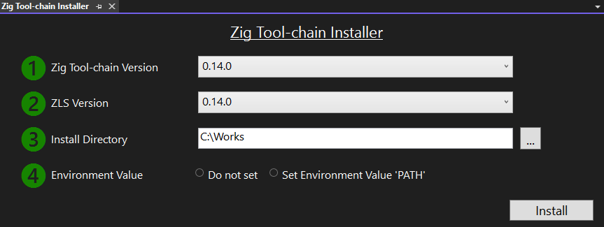

# List of Supported Features
```
Editor
	Settings(General,ScrollBars,Tabs)		[✔]  
	Syntax highlighting using Syntaxes file	[✔]  
	Auto-completion using Snippets files	[✔]  
	Support for Language Server Features	[✔]  
		Completions							[✔]
		Hover								[✔]  
		Goto definition/declaration			[✔]  
		Find references						[✔]  
		Rename symbol						[✔]  
		Selection ranges					[✔]  
		Folding regions						[✔]  
		Code actions						[✔]  
		Inlay hints							[✔]  
		Diagnostics							[  ] 
		Document symbols					[  ]  
		Semantic token highlighting			[  ]  
	Automatically inserts a closing Bracket [✔]
	Document Formatting using 'zig fmt'		[✔]

Navigation  
	Object Browser							[  ]

Build  				
	Build									[✔]  
	OS selection							[✔]  
	Architecture selection					[✔] 
		WebAssembly							[✔]
	Optimization selection					[✔]  
	GUI configuration						[✔]  
	C/C++ integration						[✔]  
	Embedding resources						[✔]
	Build.zig generation					[✔]  (Project file mode) 
	Build.zig.zon generation				[✔]  (Project file mode) 
	ZigPackage								[✔]  (Open folder mode) 

Debug
	Step execution							[✔]  
	Set breakpoints							[✔]  
	Variable inspection						[✔]  
	Cross-platform Debugging				[✔]		[new!!]
		WebAssembly							[  ]
	Hot Reload								[  ]

Profiling
	CPU Usage, Memory Usage, Events, File IO	[✔]  

Testing
	Run code tests using Test Explorer		[✔]  
	Unit Test Debugging						[✔]		[new!!]

Templates
	Package, Project, file					[✔]
 
Project file mode							[✔]  
Open folder mode							[✔]  

Zig Tool-chain Installer					[✔] 
Zig Package Installer						[✔]		[new!!]
Help										[✔]  
```

___
# How to Set Up with Zig Tool chain Installer

1. Install ZigVS from [Extensions] → [Manage Extension] or from [Visual Studio Marketplace](https://marketplace.visualstudio.com/items?itemName=LuckystarStudio.ZigVS)

2. [Extensions] → [ZigVS] → [Zig Tool chain Installer]  

  

3.ToolChainInstaller window will be opened  

a. Select Zig Tool chain Version
b. Select ZLS Version
c. Set Install Directory  
If you specify a folder without write permissions, the Install button will not be activated. Please restart Visual Studio with Administrator privileges

d. Select if you set Environment Value 'PATH'
  
4. Once everything is set up, the Install button will become active, so press the Install button  




5. The progress and results of the installation will be displayed in the output window  


6. You might need restart your Visual Studio

Note: If you see "Access to the path '....' is denied", the following scenarios might be considered  
    * File in use: Please close the application that is opening the file  
    * Directory without write permission: Please restart Visual Studio as Administrator

___
# How to Set Up Manually

1. Install ZigVS from [Extensions] → [Manage Extension] or from [Visual Studio Marketplace](https://marketplace.visualstudio.com/items?itemName=LuckystarStudio.ZigVS)

2. Zig Compiler:  
Download [Zig](https://ziglang.org) and extract it to your desired location.  
ZigVS has been tested with [Zig ver 0.13.0](https://ziglang.org/download/0.13.0/zig-windows-x86_64-0.13.0.zip).

3. ZLS Language Server:  
Download [Zig Language Server (zls)](https://github.com/zigtools/zls) and place it in the same directory as the Zig Compiler.

Note: The [compatibility](https://github.com/microsoft/language-server-protocol/issues/1847) issue that previously existed between Visual Studio 2022 and ZLS has been resolved as both Visual Studio 2022 and ZLS have been fixed. It can now be used in Visual Studio 2022 without any modifications to ZLS.

4. Set the **ZIG\_TOOL\_PATH** environment variable to a directory with Zig compiler and ZLS binaries
       (The path specified for ZIG_TOOL_PATH needs to end with a backslash '\' )

___
# How to use

ZigVS supports **Open folder mode** and **Project file mode**

* Open folder mode  
    Open a folder with an existing zig project.  
    Uses the zig build system with a build.zig file.  

```
	Build Tool：zig.exe  
	Compiler：zig.exe  
	Build File：Build.zig   
	Source Code：.zig .cpp .c 
	GUI/Editor：Visual Studio 2022  
```

* Project file mode  
    Create and manage zig projects (.zigproj) using the VS2022 IDE.  
    Use the zig compiler along with MSBuild and VS2022 project management.  
    Link C/C++ libraries and zig libraries in a VS2022 solution file.  

	Installing the Desktop Development with C++ module via Visual Studio Installer is necessary.

```
	Build Tool：MSBuild.exe  
	Compiler：zig.exe  
	Build File：Zig Project file (extension .zigproj) or Zig Project file create the build.zig
	Source Code：.zig .cpp .c 
	GUI/Editor：Visual Studio 2022  
```

___
# Open Folder Mode:
To start Open Folder Mode, do one of the following in Visual Studio:

    A. If creating a new Zig package:

	A-1. Select [File] → [New] → [Zig Package (zig.exe init)].


	A-2. Select the directory and package name, choose whether to open the folder, and then press the create button.


	B. If selecting a template

	B-1. Use the wizard and select [Create a new project].
		 The project template supports both project mode and open folder mode.


	C. If opening an existing Zig Package:

    C-1. Use the wizard and select [Open a local folder], then choose the folder containing Build.zig.


    D. Select [File] → [Open] → [Folder] and choose the folder containing Build.zig.  


	To select the Build.zig to use, right-click on it and choose [Set as Startup Item].


	[Build], [Debug], [Start] button, and [Configuration] drop down will become active for you to start your work.


	If you want to change settings, select [Tools] → [Options] and make changes in the Options window under [ZigVS].


___
# Project File Mode
To start Project File Mode, do one of the following in Visual Studio:

*Note	Installing the Desktop Development with C++ module via Visual Studio Installer is necessary.*

    A. If creating a new project:

	a-1. Use the wizard and select [Create a new project] or [File] → [New].


    B. If opening an existing project:

	b-1. Select [Open a project or solution] or [File] → [Open] → [Project/Solution].

	If you want to change settings, right-click on [ZigProject file] in [Solution Explorer], select [Property], and [Project Property Page] will appear.


___
# Cross-platform Build

* Open Folder Mode  
	Select CPU and OS from the Standard Menu bar  

* Project File Mode  
	Select CPU from the Stan dared Menu bar  
    Select OS from [Project Property Page] → [Build] → [Assembly] → [OS]  


___
# Cross-platform Debugging

* Need to make LaunchOption.xml, see [the schema file](https://github.com/microsoft/MIEngine/blob/main/src/MICore/LaunchOptions.xsd)  

___
# Cross-platform Debugging (Linux ubuntu on WSL)

1. Generate the key pair on Windows.  
   Run ssh-keygen with out a passphrase.  
   id_rsa and is_rsa.pub will be generated.
```
ssh-keygen -t rsa -b 4096
dir %USERPROFILE%\.ssh
```

2. Install openssh-server and gdb on linux  
```
sudo apt update
sudo apt install openssh-server gdb
```

3. Change ssh server port from 22 to 2022 on linux  
```
sudo sed -i -E 's,^#?Port.*$,Port 2022,' /etc/ssh/sshd_config
sudo service ssh start
```

4. Copy 'id_rsa.pub' from windows to linux  
```
scp -P 2022 %USERPROFILE%\.ssh\id_rsa.pub [linux user name]@[linux ip address]:/home/[linux user name]/.ssh/authorized_keys
```

5. reboot ssh server.
```
sudo service ssh restart
```
  
6. Create a text file named 'LaunchOptions.xml' in the current project directory.  

```
<?xml version="1.0" encoding="utf-8"?>
<PipeLaunchOptions xmlns="http://schemas.microsoft.com/vstudio/MDDDebuggerOptions/2014"
	PipePath="C:\Windows\System32\OpenSSH\ssh.exe"
	PipeArguments="-p 2022 -i C:\Users\[windows user name]\.ssh\id_rsa [linux user name]@[linux ip address] -t gdb --interpreter=mi"
	TargetArchitecture="x64"
	MIMode="gdb"
	DebuggerPath="/usr/bin/gdb"
	Environment="VAR1=value1;VAR2=value2"
	ExePath="/mnt/[path to the target on windos]"
	ExeArguments=""
	WorkingDirectory="/home/[linux user name]"
	LaunchCompleteCommand="exec-run">
	<AdditionalSOLibSearchPath>/usr/lib;/usr/local/lib</AdditionalSOLibSearchPath>
</PipeLaunchOptions>
```

7. Select MIEngie as a Visual Studio Debug Engine

* Open Folder Mode  
    Select OS from [Tools] → [Options] → [ZigVS] → [Folder Mode] → [Debug]

	[Debug Engine] MIEngine  
	[MIEngine launch Options file name] LaunchOptions.xml  


* Project File Mode    
    Select OS from [Project Property Page] → [Debug]

	[Debug Engine] MIEngine  
	[MIEngine launch Options file name] LaunchOptions.xml  
  
___
# Cross-platform Debugging (Linux ubuntu on none WSL)

1. Generate the key pair on Windows.  
   Run ssh-keygen with out a passphrase.  
   id_rsa and is_rsa.pub will be generated.
```
ssh-keygen -t rsa -b 4096
dir %USERPROFILE%\.ssh
```

2. Install openssh-server and gdb on linux  
```
sudo apt update
sudo apt install openssh-server gdb
```

3. Copy 'id_rsa.pub' from windows to linux
```
scp %USERPROFILE%\.ssh\id_rsa.pub [linux user name]@[linux ip address]:/home/[linux user name]/.ssh/authorized_keys
```

4. reboot ssh server.
```
sudo service ssh restart
```
  
5. Create a text file named 'LaunchOptions.xml' in the current project directory.  

```
<?xml version="1.0" encoding="utf-8"?>
<PipeLaunchOptions xmlns="http://schemas.microsoft.com/vstudio/MDDDebuggerOptions/2014"
	PipePath="C:\Windows\System32\OpenSSH\ssh.exe"
	PipeArguments="-p 22 -i C:\Users\[windows user name]\.ssh\id_rsa [linux user name]@[linux ip address] -t gdb --interpreter=mi"
	TargetArchitecture="x64"
	MIMode="gdb"
	DebuggerPath="/usr/bin/gdb"
	Environment="VAR1=value1;VAR2=value2"
	ExePath="[path to the target on linux]"
	ExeArguments=""
	WorkingDirectory="/home/[linux user name]"
	LaunchCompleteCommand="exec-run">
	<AdditionalSOLibSearchPath>/usr/lib;/usr/local/lib</AdditionalSOLibSearchPath>
</PipeLaunchOptions>
```

5. Select MIEngie as a Visual Studio Debug Engine

* Open Folder Mode  
    Select OS from [Tools] → [Options] → [ZigVS] → [Folder Mode] → [Debug]

	[Debug Engine] MIEngine  
	[MIEngine launch Options file name] LaunchOptions.xml  


* Project File Mode    
    Select OS from [Project Property Page] → [Debug]

	[Debug Engine] MIEngine  
	[MIEngine launch Options file name] LaunchOptions.xml  

6. Set the command the output to the target machineL

* Open Folder Mode  
    [Tools] → [Options] → [ZigVS] → [Folder Mode] → [Pre Debug]  

	[Pre Debug Command] scp
	[Pre Debug Command Arguments] -P 22 [target file fullpath] [Linux User Name]@[Linux Machine IP Addredd]:/home/[Linux User Name]/[your project directory]  


* Project File Mode    
    [Project Property Page] → [Debug] → [PreDebug]

	[Pre Debug Command] scp
	[Pre Debug Command Arguments] -P 22 [target file fullpath] [Linux User Name]@[Linux Machine IP Addredd]:/home/[Linux User Name]/[your project directory]  

Tips

* Please check if the target file on linux has executable attribute.

* The following command can be useful for troubleshooting when things don't work as expected.  
```
service ssh status
```
```
grep sshd /var/log/auth.log
```

___
# Cross-platform Debugging (Android)

1. Create a text file named 'LaunchOptions.xml' in the current project directory.  

```
<?xml version="1.0" encoding="utf-8"?>
<!-- Android Launch -->
<AndroidLaunchOptions xmlns="http://schemas.microsoft.com/vstudio/MDDDebuggerOptions/2014"
	Package="com.example.hellojni"
	LaunchActivity=".HelloJni"
	SDKRoot="c:\android-bundle\sdk"
	NDKRoot="c:\android-ndk"
	TargetArchitecture="arm"
	IntermediateDirectory="c:\android-ndk\samples\hello-jni\obj\local\armeabi-v7a"
	AdditionalSOLibSearchPath=""
	DeviceId="emulator-5554"/>
```  
```  
<?xml version="1.0" encoding="utf-8"?>
<!-- Android Attach -->
<AndroidLaunchOptions xmlns="http://schemas.microsoft.com/vstudio/MDDDebuggerOptions/2014"
    Package="com.example.hellojni"
    Attach="true"
    SDKRoot="c:\android-bundle\sdk"
    NDKRoot="c:\android-ndk"
    TargetArchitecture="arm"
    IntermediateDirectory="c:\android-ndk\samples\hello-jni\obj\local\armeabi-v7a"
    AdditionalSOLibSearchPath=""
    DeviceId="emulator-5554"/>
```

___
# Cross-platform Debugging (iOS)

1. Create a text file named 'LaunchOptions.xml' in the current project directory. 

```
<?xml version="1.0" encoding="utf-8"?>
<IOSLaunchOptions xmlns="http://schemas.microsoft.com/vstudio/MDDDebuggerOptions/2014"
    RemoteMachineName="Chucks-mac-mini"
    PackageId="riesco.Sample"
    vcremotePort="3000"
    IOSDebugTarget="device"
    TargetArchitecture="x86"
    AdditionalSOLibSearchPath=""/>
```

___
# Cross-platform Debugging (Serial Port Debugger)

1. Create a text file named 'LaunchOptions.xml' in the current project directory. 

```
<?xml version="1.0" encoding="utf-8"?>
<SerialPortLaunchOptions xmlns="http://schemas.microsoft.com/vstudio/MDDDebuggerOptions/2014"
    Port="COM1" TargetArchitecture="arm"/>
```

___
# Testing
To perform tests, select [Test] → [Test Explorer] to open the Test Explorer window. If .zig source code includes unit tests, their filenames will be listed.

　　

___
# Profiler  

1. [Debug] > [Start Debugging] (or Start on the toolbar, or F5).

When the app finishes loading, the Summary view of the Diagnostics Tools appears. If you need to open the window, click Debug > Windows > Show Diagnostic Tools.

2. When you choose Record CPU Profile, Visual Studio will begin recording your functions and how much time they take to execute. You can only view this collected data when your application is halted at a breakpoint.


___
# Package Installer

1, [Extensions] → [ZigVS] → [Zig Package Installer]  


2, Browse to the repository and branch that you want to install in the WebView.  
3, Select a Installation Method from the drop-down.  
   Currently, git and unzip are working correctly.  
4. Once everything is set up, the Install button will become active, so press the Install button  


___
# Formatting
* Right-click in the solution explorer and select 'zig fmt'  

  

___
# Editor Setting

* [Tools]→[Options]→[Text Editor]→[Zig]


___
# Syntax Highlighting

Example of changing Literals and Operators  


You can change the colors and fonts of the Syntax Highlighting. It is possible to create a more color-coded and visually appealing screen than the default settings of Visual Studio. The following Display Items can be modified.  

* Plain Text
* Comment
* Keyword
* Literal
* Operator
* String
* Type


[Tool]→[Environment]→[Fonts and Colors]→[Display items]  


___
# Snippets 

* Open Snippet manager  
[Tool] → [Code Snippets Manager] → [Zig]


* Insert Snippets  
Right-click in the code editor → [Snippets] → [Insert Snippet]

  

Note: [Code snippets: what they are and how to add one](https://learn.microsoft.com/en-us/visualstudio/ide/code-snippets?view=vs-2022)

___
# Formatting
Right-click in the solution explorer and select 'zig fmt'  

  

___
# Help  

[Extensions] → [ZigVS] → [User Manual Page]  


___
# Questions, Requests, etc.
Please use the Q&A page on Visual Studio Marketplace. Support is available in both English and Japanese.

___
# License
Refer to the LICENSE.txt file for licensing information.

___
# Extension Name
ZigVS

___
# Publisher
LuckyStar Studio LLC  


